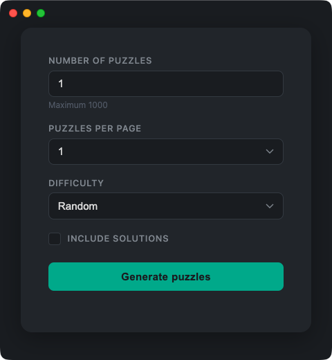

# Sudoku Generator



Electron app that generates PDFs with sudoku puzzles.
Uses a C++ native addon (N-API) for puzzle generation.

## Prerequisites

- macOS (only platform tested currently)
- Node.js 16.14+
- Python 3.x

## Development

```bash
./dev.sh
```

This installs dependencies, builds the native addon for Electron, and launches the app with DevTools enabled.

## Release Build

```bash
./build.sh
```

Output goes to `out/make/`
